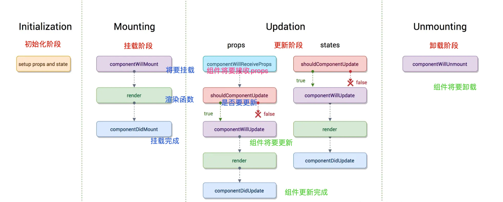

# day16笔记

## 1、状态机

### 1.1、状态机介绍

- 状态机： 讨论组件的data数据！ **叫做state!**  
- 注意：只有类组件有状态机，函数组件没有！

### 1.2、使用

- 定义状态！（函数组件没有状态！）

  ```js
  // 组件类的构造器里面定义
  constructor(){
          super();
          this.state ={
              key:val,
              key2:val2
          }
  }
  ```

- 使用state

  ```js
  {this.state.key}
  {this.state.key2}
  ```

- 修改state

  **注意：不能直接赋值修改！**

  ```js
  this.state.key = newval;   //错误写法！  虽然state的内容发生了变化，但是页面不会更新！
  ```

  **要修改state数据，必须使用setState函数！**

  - `this.setState({修改对象},()=>{ 这里才可以获取到state的最新值！ })`

  - `this.setState((state)=>({}),()=>{ 这里才可以获取到state的最新值！ })`

  - 错误写法

    ```js
    this.setState();   //setState 调用会重新执行render函数！是一个异步的过程！
    this.state.key    //这里的值还是老值！ 因为setState是异步更新的！
    ```


## 2、组件通信

### 2.1、父传子

- props

- 实现

  ```html
  // 父模板里面
  <子组件名  属性名="属性值"  属性名2={变量} />
  ```

  ```js
  // 子组件里面!!！
  		// 类组件
  		this.props 表示了 组件传入的数据!
  		// 函数组件
  		function 组件名(props){
  		   props 表示了 组件传入的数据!
  		}
  ```

  **可以传递任何内容！**

- **不允许修改props!!!不能违背单向数据流！**

- **props的验证： props的验证依赖于prop-types模块，不用下载，直接使用！**

  - 类型校验

    ```js
    import PropTypes from 'prop-types';
    class 组件  extends React.Component{
        // 静态属性
    	  static  propTypes = {
    	      属性名:PropTypes.类型   // 单类型校验！
    	      属性名:PropTypes.oneOfType([   // 多类型校验！
    	       	 PropTypes.类型1,
    	       	 PropTypes.类型2
    	      ])
    	  }
    	  ...
    }
    // 或者写在外部
    组件.propTypes = {
      属性名:PropTypes.类型   // 单类型校验！
      属性名:PropTypes.oneOfType([   // 多类型校验！
        PropTypes.类型1,
        PropTypes.类型2
      ])
    }
    ```

  - 必须传入

    ```js
    组件.propTypes = {
      属性名:PropTypes.类型.isRequired   
      属性名:PropTypes.oneOfType([  
        PropTypes.类型1,
        PropTypes.类型2
      ]).isRequired
    }
    ```

  - 默认值

    ```js
    import PropTypes from 'prop-types';
    class 组件  extends React.Component{
        // 静态属性
    	  static  defaultProps = {
    	      属性名:默认值
    	  }
    	  ...
    }
    // 或者写在外部
    组件.propTypes = {
     属性名:默认值
    }
    ```

  - 自定义校验函数

    ```js
    组件.propTypes = {
      属性名:function(props,propsName,componentName){
          props[propsName]   // 获取对应的属性值！ 然后进行校验，校验失败抛出Error
      }
    }
    ```

- **构造器里面使用props**

  ```js
  constructor(props){
          super(props);
          console.log(this.props)  //undefined!!!
          // 注意：如果直接在组件的构造器函数里面去使用props，其实是没有的！
          // 解决此问题：
              // 构造器显示的传递一下props，且传给super函数！这样就可以在构造器中使用props!
      }
  ```

  

### 2.2、子传父

- props

- 本质： **父将一个自身的函数，传递给子组件，让子组件去调用它！ 传入的父的事件函数要绑定好this的指向！否则指向props**  

- 实现

  ```jsx
  class 父组件  extends React.Component{
      事件函数=(形参)=>{
        
      }
      render(){
           return <组件 属性名={ this.事件函数 } />
      }
  }
  ```

  ```html
  // 子组件模板里面
  <标签 onClick={ this.props.属性名  } />
  
  <标签 onClick={ ()=>this.props.属性名('实参') } />
  ```


### 2.3、非父子通信

- 事件触发器的on和emit方法。组件中on去监听，另外组件emit取触发。

- 实现

  ```js
  // 创建一个事件触发器  bus.js
  const EventEmitter = require('events');
  
  class MyEmitter extends EventEmitter { }
  
  const myEmitter = new MyEmitter();
  
  
  export default myEmitter;
  ```

  监听事件

  ```js
  import bus from "../bus"
  //构造器里面去监听！
   constructor(){
          super();
          this.state ={
              msg:""
          }
          bus.on('kaixin',(val)=>{
              alert('开心被触发了,传入了'+val)
              this.setState({
                  msg:val
              })
          })
      }
  ```

  触发事件

  ```js
  import bus from "../bus"
  
  bus.emit('kaixin',实参)
  ```

  

## 3、表单处理

```js
// vue表单： v-model 核心指令！
        // <input type="text" :value="变量" @input="变量=$event.target.value" />
// React表单，不是双向数据绑定的！单向数据流！
    // 表单控件：
        // 受控组件：  要改变数据  value={变量}  checked={变量}  onChange 事件！  
        // 非受控组件： 不改变数据  defaultValue={变量}  defaultChecked={变量}   v或者value和checked的同时加上readyOnly属性，变成一个只读控件！
```

**模拟双向数据绑定**

```jsx
import React, { Component } from 'react';

let defaultItem = {
    username:"",
    password:"",
    sex:"1",
    ah:[],
    isagree:true,
    city:"",
    notes:""
}

class App extends Component {
    constructor(){
        super();
        this.state = {
            forminfo:{...defaultItem}   // 其实应该深拷贝！！！
        }
    }
    // 单选、单行文本框
    singleChange(attr,type,ev){
        let newval = ev.target[type];
        console.log(newval)
        this.setState(state=>({
            forminfo:{
                ...state.forminfo,
                [attr]: newval
            }
        }))
    }
    // 多选框
    multipleChange(attr,ev){
        let newval = ev.target.value;
        let arr = this.state.forminfo[attr];
        let idx = arr.indexOf(newval);  // 找到所在的下标，没有找到就返回-1，找到了就得到对应的下标了
        if(idx===-1){
            arr.push(newval)
        }else{
            arr.splice(idx,1)
        }
        this.setState(state => ({
            forminfo: {
                ...state.forminfo,
                [attr]: arr
            }
        }))
    }
    submit= ()=>{
        console.log(this.state.forminfo)
    }
    reset = ()=>{
        this.setState(state => ({
            forminfo: {
               ...defaultItem   // 其实应该深拷贝！！！
            }
        }))
    }
    render() {
        let { username, password, sex, ah, isagree, city, notes } = this.state.forminfo
        return (
            <div style={{padding:"30px"}}>
                <h3>注册信息</h3>
                <p>
                    用户名：<input type="text" value={username} onChange={this.singleChange.bind(this,'username','value')} />{username}
                </p>
                <p>
                    密码：<input type="password" value={password} onChange={this.singleChange.bind(this, 'password', 'value')} />{password}
                </p>
                <p>
                    性别：
                    <label><input type="radio" value="1" checked={sex === "1"} onChange={this.singleChange.bind(this, 'sex', 'value')} />男</label>
                    <label><input type="radio" value="0" checked={sex === "0"} onChange={this.singleChange.bind(this, 'sex', 'value')}  />女</label>
                    {sex}
                </p>
                <p>
                    爱好：
                    <label><input type="checkbox" value="wjj" checked={ah.includes('wjj')} onChange={this.multipleChange.bind(this, 'ah')} />挖掘机</label>
                    <label><input type="checkbox" value="ttj" checked={ah.includes('ttj')} onChange={this.multipleChange.bind(this, 'ah')} />推土机</label>
                    <label><input type="checkbox" value="jbj" checked={ah.includes('jbj')} onChange={this.multipleChange.bind(this, 'ah')} />搅拌机</label>
                    <label><input type="checkbox" value="ssc" checked={ah.includes('ssc')} onChange={this.multipleChange.bind(this, 'ah')} />洒水车</label>
                    <label><input type="checkbox" value="dj" checked={ah.includes('dj')} onChange={this.multipleChange.bind(this, 'ah')} />吊机</label>
                    <label><input type="checkbox" value="xfc" checked={ah.includes('xfc')} onChange={this.multipleChange.bind(this, 'ah')} />消防车</label>
                    {JSON.stringify(ah)}
                </p>
                <p>
                    是否成年
                    <label><input type="checkbox" checked={isagree} onChange={this.singleChange.bind(this, 'isagree', 'checked')} />男</label>
                    {isagree ? "true":"false" }
                </p>
                <p>
                    家乡：
                    <select value={city} onChange={this.singleChange.bind(this,'city','value')}>
                        <option value="">==请选择==</option>
                        <option value="bj">==北京==</option>
                        <option value="tj">==天津==</option>
                        <option value="nj">==南京==</option>
                    </select>
                    {city}
                </p>
                <p>
                    留言：
                    <textarea value={notes} onChange={this.singleChange.bind(this,'notes','value')}></textarea>
                    {notes}
                </p>
                <p>
                    <button onClick={ this.submit }>提交</button>
                    <button onClick={this.reset}>重置</button>
                </p>
            </div>
        );
    }
}

// vue表单： v-model 核心指令！
        // <input type="text" :value="变量" @input="变量=$event.target.value" />
// React表单，不是双向数据绑定的！单向数据流！
    // 表单控件：
        // 受控组件：  要改变数据  value={变量}  checked={变量}  onChange 事件！  
        // 非受控组件： 不改变数据  defaultValue={变量}  defaultChecked={变量}   v或者value和checked的同时加上readyOnly属性，变成一个只读控件！

let x = 'sex';
let obj = {
    name:"张飞",
    [x]:'123123123'
}
console.log(obj)


export default App;


```


## 4、生命周期

- 函数式组件没有生命周期函数，如果要处理生命周期需要使用Hook

- 类组件有生命周期钩子函数

- 配图

  


- 初始化阶段

  - constructor

- 挂载阶段

  - render
  - componentDidMount   组件挂载完成！！！初始化插件！

- 更新阶段

  - shouldComponentUpdate    是否需要更新！

    ```js
      shouldComponentUpdate(newProps,newState){
            // console.log(newProps)  // 新的props!   this.props! 老的
            // console.log(newState)  // 新的state!   this.state! 老的
            console.log("组件是否应该被更新：shouldComponentUpdate")
            // 该方法需要返回一个布尔值，true表示要更新，false表示不能更新！
            return true;
        }
    ```

  - render

  - componentDidUpdate  组件更新完成！！！ 再次初始化插件！

    ```js
    componentDidUpdate(prevProps,prevState){
            // console.log(prevProps)   // 老的props    this.props 新的！
            // console.log(prevState)   // 老的state    this.state 新的！
            console.log("组件更新完成：componentDidUpdate")
            // this.setState({})  // 切记不能在任何一个更新函数里面去调用setState会更新死循环！
        }
    ```

    **切记不能在任何一个更新函数里面去调用setState会更新死循环！**

- 卸载阶段

  - componentWillUnmount   组件将要被卸载！


## 5、DOM操作

- Ref 作用： 获取DOM节点或者组件对象！

- 三种写法

  - 字符串写法

    ```html
    <标签  ref='名称' />
    
    this.refs.名称   
    // 注意：此方法已经被废弃！
    ```

  - createRef

    ```jsx
    constructor(){
            super()
            this.属性名 = React.createRef();
     }
    render(){
      return <button ref={this.属性名}>1111</button>
    }
    
    // 获取
    this.属性名.current
    ```

  - 函数式

    ```jsx
    constructor(){
            super()
            this.属性名 = null;
     }
    render(){
      return <button ref={ node=>this.属性名=node }>1111</button>
    }
    // 获取
    this.属性名
    ```

    **refs的使用必须要在组件挂载完成之后才可以使用！**

- 插件的使用 

  - 使用swiper  https://swiperjs.com/react/

- **如何使用scss**

  ```js
  npm install sass-loader node-sass --save-dev
  ```

  **要使用新脚手架！！！**

  


