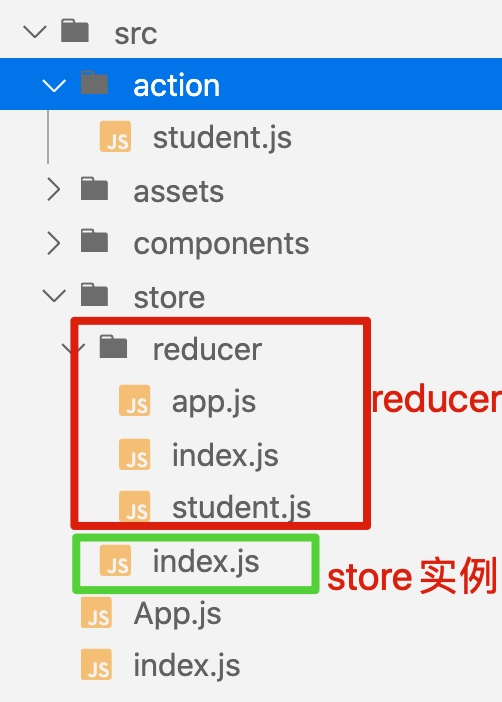

# day18笔记

- 状态层：将应用的数据集中管理起来一个数据层！ 
  - 目的： 对于大型项目而言，合理状态层分层会让数据流向简单清晰，且易于维护。
  - react中如何使用状态层！ 状态层有一个核心思想架构就是flux

## 1、flux

### 1.1、flux介绍

- flux介绍：https://facebook.github.io/flux/
- 说明：它更像是一种模式，而不是正式的框架，利用单向数据流来补充React的可组合视图组件。

- 学习文档：http://www.ruanyifeng.com/blog/2016/01/flux.html
- 基本概念：
  - **View**： 视图层
  - **Action**（动作）：视图层发出的消息（比如mouseClick）
  - **Dispatcher**（派发器）：用来接收Actions、执行回调函数
  - **Store**（数据层）：用来存放应用的状态，一旦发生变动，就提醒Views要更新页面


**Flux 的最大特点，就是数据的"单向流动"。**

1. 用户访问 View
2. View 发出用户的 Action
3. Dispatcher 收到 Action，要求 Store 进行相应的更新
4. Store 更新后，发出一个"change"事件
5. View 收到"change"事件后，更新页面

### 1.2、flux使用

- 安装

  ```js
  npm i flux --save
  ```

- 创建派发器   

  ```js
  // Dispatcher 
  // 导入仓库实例！
  import store from "./store"
  // 派发器！！
  const Dispatcher = require('flux').Dispatcher;
  // 实例化一个派发器
  let dispatcher = new Dispatcher();
  
  
  // 注册派发事件
  dispatcher.register(function(action){
      switch(action.type){
          case "ADD":
              console.log("添加事件")
              store.state.rootnum += action.payload
              store.emit('datachange')
              break;
          case "REDUCE":
              console.log("减少事件")
              store.state.rootnum -= action.payload
              store.emit('datachange')
              break;  
          default:
              console.log("默认事件");      
      }
      console.log(store.state);
  })
  
  
  // setTimeout(() => {
  //     // 触发派发器
  //     dispatcher.dispatch({
  //         type:'ADD',
  //         payload:10
  //     })
  // }, 2000);
  
  // setTimeout(() => {
  //     // 触发派发器
  //     dispatcher.dispatch({
  //         type: 'REDUCE',
  //         payload: 5
  //     })
  // }, 4000);
  
  
  // 实例化一个派发器   let dispatcher = new Dispatcher();
  // 两个核心方法：
      // dispatcher.register(function(action){  ...  })
      // dispatcher.dispatch(实参)
  
  // 暴露派发器！！！
  export default dispatcher;    
  ```

  **dispatcher.register(function(action){  ...  })**
  **dispatcher.dispatch(实参)**

- 仓库实例

  ```js
  // store.js
  const Events = require('events');
  
  // 仓库类！ 继承了 事件触发器模块！拥有了on 和 emit 方法
  class Store extends Events {
      state = {
          rootmsg:"我是仓库里面的msg!",
          rootnum:10
      }
  }
  // 实例化一个仓库对象（on和emit方法）
  let store = new Store();
  // 暴露出去
  export default store;
  
  
  ```

- 页面组件中

  - 导入派发器

    - `Dispatcher.dispatch({type:"xxx",payload:"xxx})`

  - 导入仓库实例

    - `{store.state.xxx}`
    - `store.on('datachange',()=>{  this.setState({}) })`

  - 代码

    ```jsx
    import React, { Component } from 'react';
    
    import store from "../store"
    import Dispatcher from "../Dispatcher"
    
    class One extends Component {
        change =()=>{
            Dispatcher.dispatch({
                type:"ADD",
                payload:5
            })
        }
        render() {
            return (
                <div className="one">
                    <button onClick={this.change}>修改仓库里面的rootnum</button>
                    仓库里面的数据：{store.state.rootnum}
                </div>
            );
        }
        componentDidMount() {
            store.on('datachange', () => {
                this.setState({})
            })
        }
    }
    
    export default One;
    
    ```

    

## 2、redux

- 含义：**Redux 是 JavaScript 状态容器，提供可预测化的状态管理。**
- 文档地址：https://redux.js.org/
- 中文文档地址：https://www.redux.org.cn/
- flux是一个架构思想，redux是他的一种具体实现的表现！！！

### 2.1、核心概念

- **Action**
- **Store**
- **Reducer**

---

### 2.2、基础使用

- 安装

  ```
  npm i redux --save
  ```

- 模块

  ```js
  // 仓库实例
  
  import { createStore } from "redux";
  
  
  // combineReducers 合并reducer！
  // createStore 创建仓库！
  // createStore(reducer函数、初始状态、中间件等)
  
  // reducer函数有两个形参，形参1是初始state值！ 形参2是action！
  
  let initState ={
      rootnum:10
  }
  
  let reudcer = function (state = initState, action) {
      switch(action.type){
          case "ADD":
              console.log("添加事件");
              state.rootnum += action.payload
              return state;
          default:
              return state;    
      }
  }
  let store = createStore(reudcer);
  // console.log(store);
  
  // setInterval(() => {
  //     store.dispatch({
  //         type:"ADD",
  //         payload:20
  //     });
  // }, 2000);
  
  window.store = store;
  
  // store.dispatch()    // 触发action！！！修改state!
  // store.getState()    // 获取state里面的数据！！！
  // store.subscribe()   // 监听变化，只要state数据发生了变化，subscribe会自动调用！
  
  
  export default store;
  ```

  - **store.dispatch()    // 触发action！！！修改state!**
  - **store.getState()    // 获取state里面的数据！！！**
  - **store.subscribe()   // 监听变化，只要state数据发生了变化，subscribe会自动调用！**

  页面里面

  ```jsx
  import React, { Component } from 'react';
  
  import store from "../store"
  
  class One extends Component {
      constructor(){
          super();
          let state = store.getState();  // 获取仓库里面的数据！！
          this.state = {
              rootnum:state.rootnum
          }
      }
      change =()=>{
          store.dispatch({   // 触发修改！！！
              type:"ADD",
              payload:5
          })
      }
      render() {
          return (
              <div className="one">
                  <button onClick={this.change}>修改仓库里面的rootnum</button>
                  仓库里面的数据：{this.state.rootnum}
              </div>
          );
      }
      componentDidMount() {
          // 添加监听！
          // store.subscribe(callback) 一旦state里面的数据发生了变化就会自动更新！
          this.unsubscribe = store.subscribe(()=>{
              console.log("仓库里面的数据发生了变化！");
              let state = store.getState();  // 获取新的仓库数据
              this.setState({
                  rootnum: state.rootnum
              })
          })
      }
      componentWillUnmount(){
          this.unsubscribe(); // 注销监听！！
      }
  }
  
  export default One;
  ```

  **多模块**

  

  - `reducer/app.js`  app模块

    ```jsx
    // 公共模块！
    let initState = {
        title:"app模块测试标题"
    };
    
    function app(state=initState,action){
        switch(action.type){
            default:
                return state
        }
    }
    
    export default app
    ```

  - `redcuer/student.js`  student模块

    ```js
    // 学生信息模块
    let initState = {
        list:[]
    };
    
    function student(state = initState, action) {
        switch (action.type) {
            case 'ADD':
                state.list.push(action.payload)
                return state;
            case 'DEL':
                state.list.splice(action.payload,1)
                return state;    
            default:
                return state
        }
    }
    
    export default student
    ```

  - `reducer/index.js`  根reducer

    ```js
    import { combineReducers } from "redux";
    
    
    import app from "./app"
    import student from "./student"
    
    // combineReducers合并reducer函数！
    let reudcer = combineReducers({
        app: app,
        student: student
    })
    
    export default reudcer;
    ```

  - `store/index.js`  仓库实例

    ```js
    import { createStore } from "redux";
    
    import reudcer from "./reducer"
    
    let store = createStore(reudcer);
    window.store = store;  // 挂载到window，方便调试，可以删除
    
    export default store;
    ```

  - `main.js中将仓库实例挂载到Component的原型上面去，这样所有的**类组件**的this里面就会有个仓库实例。`

    ```jsx
    import React,{Component} from 'react';
    import ReactDOM from 'react-dom';
    import App from "./App"
    
    import "./assets/style.css"
    
    import store from  "./store"
    Component.prototype.$store = store; // 让所有的类组件里面this里面都会有了$store
    
    ReactDOM.render(<App/>,document.getElementById('root'));
    ```

  - **建立action层！！！把所有对应模块的dispatch触发全部写入进去，组件中只调用action层里面的方法，从而去dispatch，实现state数据的修改！**

    ```js
    // student.js
    import store  from "../store"
    export function add(data){
        store.dispatch({
            type:"ADD",
            payload:data
        })
    }
    
    export function del(idx) {
        store.dispatch({
            type: "DEL",
            payload: idx
        })
    }
    ```

  - **组件中**

    - **this.$store.state.模块名.xxx** 获取某个模块里面的数据！

    - 调用对应的action层里面的方法！

      ```jsx
      // One.js
      import React, { Component } from 'react';
      
      import { add } from "../action/student"
      
      let defaultItem = {
          title: "",
          content: ""
      }
      
      class One extends Component {
          constructor(){
              super();
              this.state = {
                  forminfo:{
                      ...defaultItem
                  }
              }
          }
          submit = () => {
              console.log(this.state.forminfo);
              if(this.state.forminfo.title && this.state.forminfo.content){
                  // store.dispatch({
                  //     type:"ADD",
                  //     payload: this.state.forminfo
                  // })
                  add(this.state.forminfo)
                  this.reset();
              }else{
                  alert('请输入完整内容')
              }
          }
          reset = () => {
              this.setState({
                  forminfo:{
                      ...defaultItem
                  }
              })
          }
          singleChange(event,attr){
              let newval = event.target.value
              this.setState(state=>({
                  forminfo:{
                      ...state.forminfo,
                      [attr]:newval
                  }
              }))
          }
          render() {
              let { title,content } = this.state.forminfo;
              return (
                  <div className="one">
                      <h1>表单！！</h1>
                      <p>
                          标题：<input type="text" value={title}  onChange={(ev)=>this.singleChange(ev,'title')} />
                      </p>
                      <p>
                          内容：<input type="text" value={content} onChange={(ev)=>this.singleChange(ev,'content')} />
                      </p>
                      <p>
                          <button onClick={this.submit}>提交</button>
                          <button onClick={this.reset}>重置</button>
                      </p>
                  </div>
              );
          }
         
      }
      
      export default One;
      
      ```

      ```jsx
      // Two.js
      import React, { Component } from 'react';
      
      // import store from "../store"
      import { del } from "../action/student"
      
      class Two extends Component {
          constructor() {
              super();
              // let state = store.getState();
              let state = this.$store.getState();
              this.state = {
                  list: state.student.list
              }
          }
          render() {
              return (
                  <div className="two">
                      <h1>列表</h1>
                      <ul>
                          {this.state.list.map((val,idx)=>{
                              // return (<li key={idx}>标题：{val.title} ==== 内容：{val.content}  <button onClick={() => store.dispatch({ type: "DEL", payload: idx })}>删除</button></li>)
                              return (<li key={idx}>标题：{val.title} ==== 内容：{val.content}  <button onClick={() => del(idx) }>删除</button></li>)
                          })}
                      </ul>
                  </div>
              );
          }
          componentDidMount(){
              // this.unsubscribe = store.subscribe(() => {
              this.unsubscribe = this.$store.subscribe(() => {
                  let state = this.$store.getState();  // 获取新的仓库数据
                  this.setState({
                      rootnum: state.rootnum
                  })
              })
          }
          componentWillUnmount() {
              this.unsubscribe(); // 注销监听！！
          }
      }
      
      export default Two;
      
      ```

      


